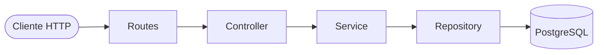

# 📋 Relatório de Resolução e Implementação da API Clínica Médica

> Documento original do professor, preservado como referência histórica da implementação de Paciente e Médico. A entrega atual de Consulta está descrita no README e em `ENTREGA_CONSULTAS.md`.

Este documento detalha todos os passos, diagnósticos, correções e implementações realizadas para tornar a API REST da **Clínica Médica** 100% funcional, integrando a persistência com **PostgreSQL**, **Docker** e **Prisma ORM**, mantendo a arquitetura em camadas e uma abordagem didática e acessível (nível júnior).

---

## 🧭 Sumário

1. [Diagnóstico do Cenário Inicial](#1-diagnóstico-do-cenário-inicial)
2. [Correção da Infraestrutura com Docker Compose](#2-correção-da-infraestrutura-com-docker-compose)
3. [Adaptação e Configuração do Prisma 7](#3-adaptação-e-configuração-do-prisma-7)
4. [Ajustes de Compilação no TypeScript](#4-ajustes-de-compilação-no-typescript)
5. [Definição dos DTOs e Tipagens](#5-definição-dos-dtos-e-tipagens)
6. [Implementação Completa das Camadas (Paciente e Médico)](#6-implementação-completa-das-camadas-paciente-e-médico)
7. [Bateria de Testes e Validação Ponta a Ponta](#7-bateria-de-testes-e-validação-ponta-a-ponta)
8. [Tabela Resumo dos Endpoints](#8-tabela-resumo-dos-endpoints)

---

## 1. Diagnóstico do Cenário Inicial

Ao analisar o repositório, identificamos que a transição de armazenamento em memória para persistência com banco de dados havia sido iniciada, mas com algumas pendências que impediam o funcionamento:

1. **Repositórios incompletos**: Os arquivos `pacienteRepository.ts` e `medicoRepository.ts` chamavam `prisma.paciente` e `prisma.medico`, porém a variável `prisma` não existia nem era importada.
2. **Serviços sem implementação**: As funções em `pacienteService.ts` e `medicoService.ts` tinham apenas assinaturas com corpos vazios `{}` e não retornavam nada.
3. **Controladores sem sincronismo**: Os controladores chamavam os serviços sem `await` e referenciavam tipos inexistentes (`Paciente`, `PacienteDTO`, `MedicoDTO`).
4. **Ausência do Schema do Prisma**: Não existia o arquivo `prisma/schema.prisma` com as tabelas do banco.
5. **Erros no TypeScript**: O comando `tsc` apontava 23 erros de compilação.
6. **Container Docker com erro de inicialização**: O container `clinica-postgres` estava em loop de reinicialização (`Restarting`).

---

## 2. Correção da Infraestrutura com Docker Compose

### Problema
O container do PostgreSQL não conseguia iniciar e emitia o seguinte erro nos logs:
```text
initdb: error: directory "/var/lib/postgresql/data" exists but is not empty
```

No arquivo `docker-compose.yml`, o volume estava mapeado para `/var/lib/postgresql/`:
```yaml
# ❌ Incorreto
volumes:
  - postgres_data:/var/lib/postgresql/
```
No PostgreSQL (imagem Alpine), os dados do banco devem residir exclusivamente dentro do subdiretório `data/`. Montar o volume na raiz `/var/lib/postgresql/` fazia o `initdb` encontrar arquivos residuais e abortar a inicialização. Além disso, havia um container legado ocupando a porta 5432.

### Solução Aplicada
1. Ajuste no `docker-compose.yml` para apontar para o diretório correto:
   ```yaml
   # ✅ Corrigido
   volumes:
     - postgres_data:/var/lib/postgresql/data
   ```
2. Interrupção do container conflitante na porta 5432.
3. Reinicialização limpa do container via:
   ```bash
   docker compose down -v
   docker compose up -d
   ```
4. **Resultado**: Container `clinica-postgres` iniciado e aceitando conexões normalmente na porta `5432`.

---

## 3. Adaptação e Configuração do Prisma 7

O projeto utiliza a versão mais recente do Prisma (**Prisma 7.10.0**), que introduziu mudanças arquiteturais em relação às versões 5 e 6:

### A) Arquivo `prisma.config.ts`
No Prisma 7, a URL de conexão não é mais declarada diretamente dentro do `schema.prisma`. Ela deve ser gerenciada pelo `prisma.config.ts` usando a função `defineConfig` e a leitura de variáveis de ambiente com `env()`:

```typescript
// prisma.config.ts
import "dotenv/config";
import { defineConfig, env } from "prisma/config";

export default defineConfig({
  datasource: {
    url: env("DATABASE_URL"),
  },
});
```

### B) Driver Adapter (`@prisma/adapter-pg`)
No Prisma 7, conexões locais diretas requerem um *driver adapter*. Foram instaladas as dependências:
```bash
npm install @prisma/adapter-pg pg
npm install -D @types/pg
```

### C) Singleton do Prisma (`src/config/prisma.ts`)
Para evitar múltiplas conexões concorrentes desnecessárias, criamos o singleton:

```typescript
// src/config/prisma.ts
import "dotenv/config";
import { PrismaClient } from "@prisma/client";
import { PrismaPg } from "@prisma/adapter-pg";

const adapter = new PrismaPg({
  connectionString: process.env.DATABASE_URL,
});

export const prisma = new PrismaClient({ adapter });
```

### D) Modelagem Relacional (`prisma/schema.prisma`)
Criamos a modelagem das tabelas `Paciente` e `Medico`:

```prisma
generator client {
  provider = "prisma-client-js"
}

datasource db {
  provider = "postgresql"
}

model Paciente {
  id           Int      @id @default(autoincrement())
  nome         String
  cpf          String   @unique
  telefone     String
  criadoEm     DateTime @default(now()) @map("criado_em")
  atualizadoEm DateTime @updatedAt @map("atualizado_em")

  @@map("pacientes")
}

model Medico {
  id            Int      @id @default(autoincrement())
  nome          String
  crm           String   @unique
  especialidade String
  criadoEm      DateTime @default(now()) @map("criado_em")
  atualizadoEm  DateTime @updatedAt @map("atualizado_em")

  @@map("medicos")
}
```

Executamos a sincronização e geração das tipagens:
```bash
npx prisma db push
npx prisma generate
```

---

## 4. Ajustes de Compilação no TypeScript

### Problema
O compilador TypeScript (`tsc`) gerava o erro `TS6059` porque o arquivo `prisma.config.ts` fica na raiz do projeto, fora do diretório configurado como `"rootDir": "./src"`.

### Solução
Adicionamos a propriedade `"include"` no `tsconfig.json`:
```json
{
  "compilerOptions": {
    "rootDir": "./src",
    "outDir": "./dist",
    ...
  },
  "include": ["src/**/*"]
}
```
Dessa forma, o compilador foca apenas nos arquivos de aplicação dentro de `src/`.

---

## 5. Definição dos DTOs e Tipagens

Seguindo o nível júnior e a simplicidade, foram criadas interfaces diretas para representar os dados trafegados na criação e edição:

- **`src/types/paciente.ts`**:
  ```typescript
  export interface PacienteDTO {
    nome: string;
    cpf: string;
    telefone: string;
  }
  ```

- **`src/types/medico.ts`**:
  ```typescript
  export interface MedicoDTO {
    nome: string;
    crm: string;
    especialidade: string;
  }
  ```

---

## 6. Implementação Completa das Camadas (Paciente e Médico)

O fluxo completo da requisição opera em 4 camadas bem definidas:



### 1. Repositórios (`src/repositories/`)
Responsáveis exclusivos por conversar com o banco de dados via Prisma Client:
- Importam o singleton `prisma`.
- Implementam: `findAll`, `findById`, `create`, `update`, `remove`.

### 2. Serviços (`src/services/`)
Contêm as regras de negócio e orquestram as chamadas aos repositórios:
- `listarPacientes()` / `listarMedicos()`
- `encontrarUmPaciente(id)` / `encontrarUmMedico(id)`
- `criarPaciente(dados)` / `criarMedico(dados)`
- `atualizarPaciente(id, dados)` / `atualizarMedico(id, dados)`
- `deletarPaciente(id)` / `deletarMedico(id)`

### 3. Controladores (`src/controllers/`)
Lidam com o protocolo HTTP (`req` e `res`):
- Aguardam as respostas assíncronas com `await`.
- Retornam status semânticos:
  - `200 OK`: listagem e atualizações.
  - `201 Created`: cadastros realizados com sucesso.
  - `204 No Content`: remoções bem-sucedidas.
  - `404 Not Found`: quando um recurso solicitado por ID não existe.

### 4. Rotas e Servidor (`src/routes/` e `src/server.ts`)
Conectam as URLs aos métodos do controlador e sobem a aplicação Express:
- [pacienteRoutes.ts](file:///home/douglas.andrade/doug/disciplinas/web/clinicaMedica/src/routes/pacienteRoutes.ts)
- [medicoRoutes.ts](file:///home/douglas.andrade/doug/disciplinas/web/clinicaMedica/src/routes/medicoRoutes.ts)
- Registradas no [server.ts](file:///home/douglas.andrade/doug/disciplinas/web/clinicaMedica/src/server.ts) através de `app.use(pacienteRoutes)` e `app.use(medicoRoutes)`.

---

## 7. Bateria de Testes e Validação Ponta a Ponta

Com o servidor rodando (`npm run dev`), executamos testes práticos em todos os endpoints:

### A) Teste de Criação (`POST`)
```bash
# Cadastro de Paciente
curl -X POST http://localhost:3000/pacientes \
  -H "Content-Type: application/json" \
  -d '{"nome":"Carlos Silva","cpf":"123.456.789-00","telefone":"11988887777"}'
# Retorno: HTTP 201 {"id":1,"nome":"Carlos Silva", ...}

# Cadastro de Médico
curl -X POST http://localhost:3000/medicos \
  -H "Content-Type: application/json" \
  -d '{"nome":"Dra. Ana Costa","crm":"CRM/SP 123456","especialidade":"Cardiologia"}'
# Retorno: HTTP 201 {"id":1,"nome":"Dra. Ana Costa", ...}
```

### B) Teste de Listagem (`GET`)
```bash
curl http://localhost:3000/pacientes
curl http://localhost:3000/medicos
# Retornam as listas completas em JSON
```

### C) Teste de Busca por ID (`GET /:id`)
```bash
curl http://localhost:3000/pacientes/1
curl http://localhost:3000/medicos/1
# Retornam os registros correspondentes com HTTP 200
```

### D) Teste de Atualização (`PUT /:id`)
```bash
curl -X PUT http://localhost:3000/medicos/1 \
  -H "Content-Type: application/json" \
  -d '{"nome":"Dra. Ana Costa e Silva","crm":"CRM/SP 123456","especialidade":"Neurologia"}'
# Retorno: Registro atualizado com HTTP 200 e campo 'atualizadoEm' renovado
```

### E) Teste de Exclusão (`DELETE /:id`) e Validação de 404
```bash
curl -i -X DELETE http://localhost:3000/medicos/1
# Retorno: HTTP 204 No Content

curl -i http://localhost:3000/medicos/1
# Retorno: HTTP 404 Not Found {"mensagem":"Médico não encontrado"}
```

### F) Validação de Compilação
- `npx tsc --noEmit`: Executou com **0 erros**.
- `npm run build`: Compilou todo o projeto para a pasta `dist/` com sucesso.

---

## 8. Tabela Resumo dos Endpoints

| Método | Rota | Descrição | Status de Sucesso |
| :--- | :--- | :--- | :--- |
| `GET` | `/pacientes` | Lista todos os pacientes | `200 OK` |
| `GET` | `/pacientes/:id` | Busca paciente por identificador | `200 OK` |
| `POST` | `/pacientes` | Cadastra novo paciente | `201 Created` |
| `PUT` | `/pacientes/:id` | Atualiza dados de um paciente | `200 OK` |
| `DELETE` | `/pacientes/:id` | Deleta um paciente | `204 No Content` |
| `GET` | `/medicos` | Lista todos os médicos | `200 OK` |
| `GET` | `/medicos/:id` | Busca médico por identificador | `200 OK` |
| `POST` | `/medicos` | Cadastra novo médico | `201 Created` |
| `PUT` | `/medicos/:id` | Atualiza dados de um médico | `200 OK` |
| `DELETE` | `/medicos/:id` | Deleta um médico | `204 No Content` |
